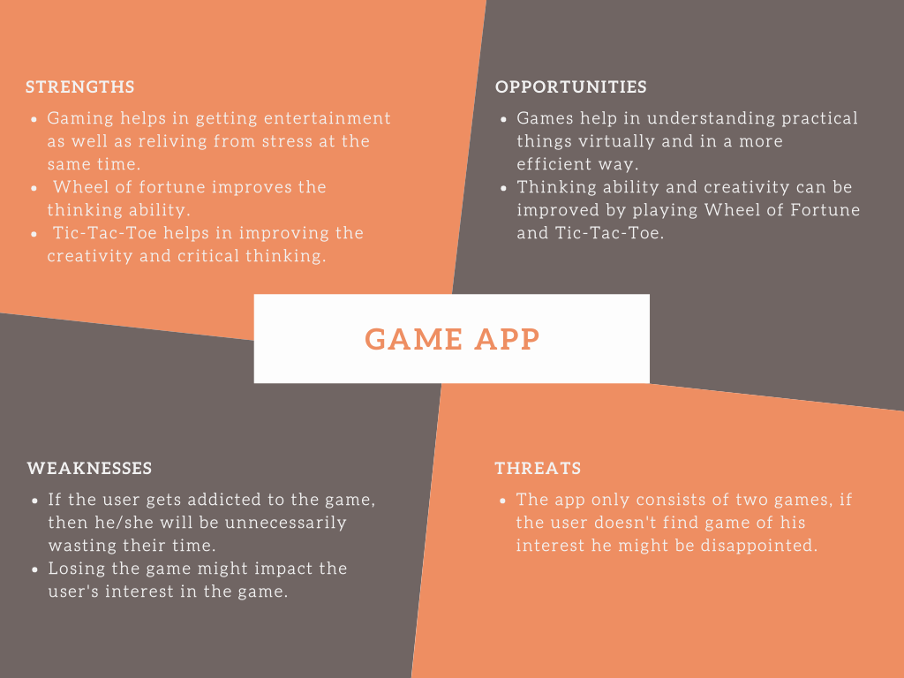

# Requirements

## Introduction

Playing Games has become a modern trend as it helps people to use their creativity while developing their imagination, dexterity, and physical, cognitive, and emotional strengths.
This is a gaming application whcih prompts the user to select between games and to play accordingly. This application includes Wheel of Fortune and Tic-Tac-Toe games as of now.

  

## Research

The growth of modern devices like phones,tablets,laptop have increased the demand for gaming application. Even before the pandemic, gaming was a global phenomenon. As smartphones proliferated, so did access to gaming. As lockdowns set in, worldwide game app downloads increased 30% in the first few months and is increasing exponentially.

## Cost and Features

### Cost:

### Features:
The features of this game include a prompt which allows the user to select between two games which are already present on the device.

The user can select either Wheel of fortune or Tic-Tac-Toe

-> **Scrabble :** Scrabble is a classic board game played by two or four players together. The game is centered around word knowledge.

-> **Tic-Tac-Toe :** In this game, users will take turns marking the Xs and Os in the 3x3 grid. The first mark must be X and the second is O. Players win by placing three of their marks in either a horizontal, vertical or diagonal row.

## Defining the System :

  

The system consists of two games, Wheel of Fortune and Tic-Tac-Toe. The user can enter his choice of his game and play accordingly.

**Scrabble :**

Scrabble is a classic board game played by two or four players together. The game is centered around word knowledge, and all players are assigned a number of tiles with different letters. Each player takes turns to add different tiles on the grid-board to form a word. Each word that you form increases your overall score. When all tiles are on the board, the person with the maximum number of points wins.

**Tic-Tac-Toe :**

Tic-Tac-Toe is a tiny game created by Mike Stampone. It is a minimalist take on the classic paper-and-pencil game for two players. Users can take turns marking the Xs and Os in the 3x3 grid. The first mark must be X and the second is O. Players win by placing three of their marks in either a horizontal, vertical or diagonal row. If neither player can place three in a row, the program declares a cat game.

# SWOT Analysis 

  

# 4W's and 1'H

**Who :**

Users of almost all age group can use this gaming application.

**What :**

It is a gaming application, where users can select the game of their choice and play accordingly. There are only two games to select between  these two games i.e Wheel of fortune and Tic-Tac-Toe.

**When :**

Anytime when the user wants to.

**Where :**

It can be played by people of any age group anywhere, from small kids in their playing hours to adults in their free time.

**How :**

The system gives the user to choose the game which he wants to play. If the user selects Scrabble:

1. System asks for the user to enter their respective user name since it can be played versus computer only.
2. The first challenge is to pick and arrange tiles in a crossword format, from left to right or top to bottom.
  The tiles already on the grid act as a framework for other words that you form.
3. Secondly, each letter that you place must fit into words already played.
4. And third, you must ensure that the words that you place earn you the maximum points.

If the user selects Tic-Tac-Toe:

1. System asks for the username.
2. The first player must mark X and the second player must mark O.
3. Players win by placing three of their marks in either a horizontal, vertical or diagonal row. 
4. If neither player can place three in a row, the program declares a cat game i.e a tie game. 

# Detail requirements
## High Level requirements:
| ID | Description | Category |
| ----- | ----- | ----- |
| HR01 | System shall allow user to select between two games. | Technical |
| HR02 | In Tic-Tac-Toe game, system shall allow user to enter his/her details. | Technical |
| HR03 | The system should display the current status of the Tic-Tac-Toe board after every move from the user/s | Technical |
| HR04 | System shall decide the winner | Technical |

## Low level requirements:
 ID | Description | HLR ID | Status (Implemented/Future) |
 | ----- | ----- | ----- | -----|
 | LR01 | When user opens this application, he can acces two games ,1 for Tic-Tac-Toe game and 2 for game 2.If he/she selects other than this, the application shall exit. | HR01 | TBD |
 | LR02 | The system shall allow user to enter their names in Tic-Tac-Toe game | HR02 | TBD |
 | LR03 | The first player should enter 'X' and second player should enter 'O' and the system shall display the Tic-Tac-Toe board everytime. | HR03 | TBD |
 | LR04 | The system shall decide the winner(if any) else it should declare as draw. | HR04 | TBD |
