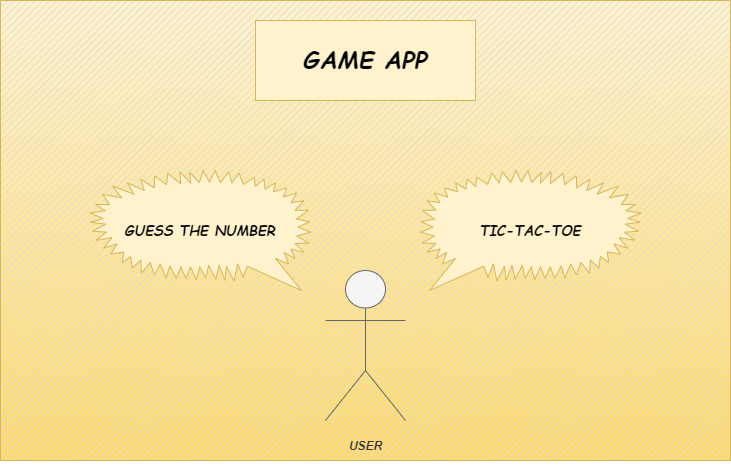

# Requirements

## Introduction

Playing Games has become a modern trend as it helps people to use their creativity while developing their imagination, dexterity, and physical, cognitive, and emotional strengths.
This is a gaming application whcih prompts the user to select between games and to play accordingly. This application includes Wheel of Fortune and Tic-Tac-Toe games as of now.

  

## Research

The growth of modern devices like phones,tablets,laptop have increased the demand for gaming application. Even before the pandemic, gaming was a global phenomenon. As smartphones proliferated, so did access to gaming. As lockdowns set in, worldwide game app downloads increased 30% in the first few months and is increasing exponentially.

## Cost and Features

### Cost

### Features
The features of this game include a prompt which allows the user to select between two games which are already present on the device.

The user can select either Guess the number or Tic-Tac-Toe

#### Guess the number 
In this game, the system will be assigned with a number and the user has to guess that number using the directions given by the system.

#### Tic-Tac-Toe 
In this game, users will take turns marking the Xs and Os in the 3x3 grid. The first mark must be X and the second is O. Players win by placing three of their marks in either a horizontal, vertical or diagonal row.

## Defining the System 

  

The system consists of two games, Guess the number and Tic-Tac-Toe. The user can enter his choice of his game and play accordingly.

### Guess the number

It is a game in which the user has to guess a number assigned by the system by using the directions given by the system.

### Tic-Tac-Toe

It is a tiny game created by Mike Stampone. It is a minimalist take on the classic paper-and-pencil game for two players. Users can take turns marking the Xs and Os in the 3x3 grid. The first mark must be X and the second is O. Players win by placing three of their marks in either a horizontal, vertical or diagonal row. If neither player can place three in a row, the program declares a cat game.

## SWOT Analysis 

  

## 4W's and 1'H

### Who

Users of almost all age group can use this gaming application.

### What

It is a gaming application, where users can select the game of their choice and play accordingly. There are only two games to select between  these two games i.e Wheel of fortune and Tic-Tac-Toe.

### When

Anytime when the user wants to.

### Where

It can be played by people of any age group anywhere, from small kids in their playing hours to adults in their free time.

### How

The system gives the user to choose the game which he wants to play. If the user selects Guess the number:

1.  System asks for the user to enter the number of players.
2.  Then the user/s have to enter their name/s and shall play.
3.  The user has to guess a number and the system will determine whether the guessed the number is equal or greater or lesser than the actual generated number.
4.  The user with less number of tries will win the game.

If the user selects Tic-Tac-Toe:

1.  System asks for the username.
2.  The first player must mark X and the second player must mark O.
3.  Players win by placing three of their marks in either a horizontal, vertical or diagonal row. 
4.  If neither player can place three in a row, the program declares a cat game i.e a tie game. 

# Detail requirements
## High Level requirements
| ID | Description | Category |
| ----- | ----- | ----- |
| HRO1 | System shall allow user to select between two games. | Technical |
| HRO2 | In Tic-Tac-Toe game, system shall allow user to enter his/her details. | Technical |
| HRO3 | The system should display the current status of the Tic-Tac-Toe board after every move from the user/s | Technical |
| HRO4 | System shall decide the winner | Technical |
| HRO5 | In Guess the number game, the system shall allow user to enter his/her details | Technical |
| HRO6 | The system shall tell the user about the current status of the guessed number | Technical |
| HRO7 | The system shall decide the winner based on the number of ateeempts | Technical |

## Low level requirements
 ID | Description | HLR ID | Status (Implemented/Future) |
 | ----- | ----- | ----- | -----|
 | LRO1 | When user opens this application, he can acces two games ,1 for Tic-Tac-Toe game and 2 for game 2.If he/she selects other than this, the application shall exit. | HRO1 | TBD |
 | LRO2 | The system shall allow user to enter their names in Tic-Tac-Toe game | HRO2 | TBD |
 | LRO3 | The first player should enter 'X' and second player should enter 'O' and the system shall display the Tic-Tac-Toe board everytime. | HRO3 | TBD |
 | LRO4 | The system shall decide the winner(if any) else it should declare as draw. | HRO4 | TBD |
| LRO5 | In guess the number game, system shall allow user/s to enter his/her details | HRO5 | TBD |
| LRO6 | The system shall ask for the user input(guessed number) and will give the comparision result between the original number and the guessed number | HRO6 | TBD |
| LRO7 | The systeem will decide the winner by comparing the number of tries taken to guess the number | HRO7 | TBD |
